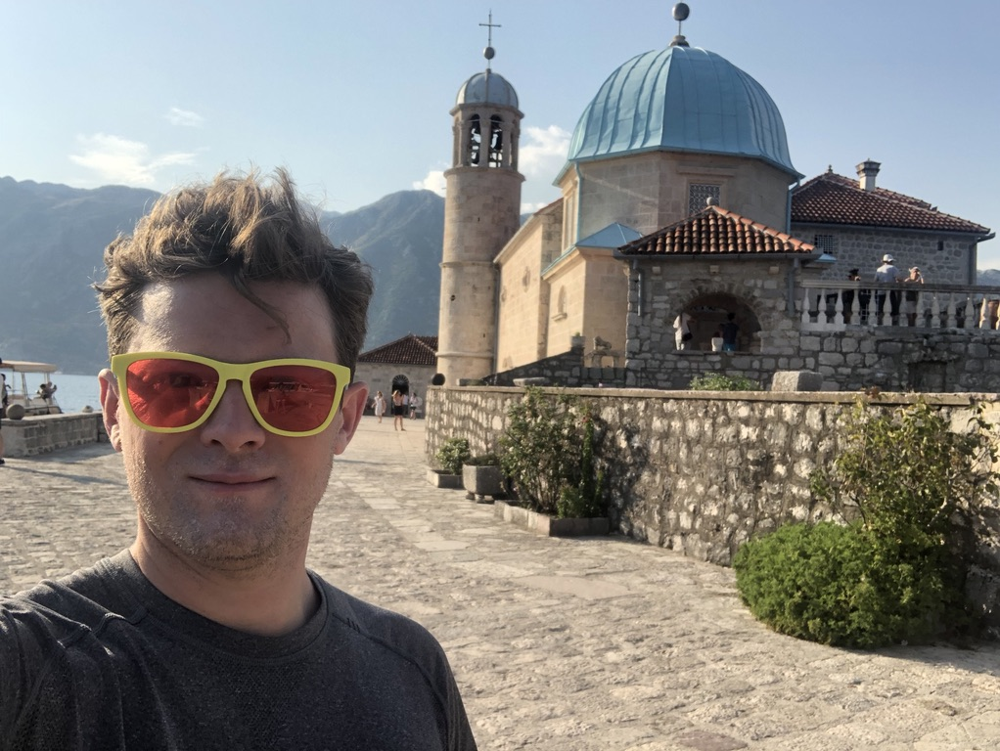

# Escola Lab

I am an assistant professor of psychiatry in the [Center for Theoretical Neuroscience](https://ctn.zuckermaninstitute.columbia.edu/) at [Columbia University](https://www.columbia.edu). I also am co-founder of [Herophilus](https://www.herophilus.com), a drug discovery company, and [Neuromatch](https://neuromatch.io/), an online neuroscience community.

# Current and former lab members

[Sean Escola](https://scholar.google.com/citations?user=0kkWrRoAAAAJ) (PI)    
[James Murray](https://scholar.google.com/citations?view_op=list_works&hl=en&hl=en&user=L8zuRf0AAAAJ&sortby=pubdate) (former postdoc, [now assistant professor at the University of Oregon](https://murraylab.uoregon.edu/))  
[Laureline Logiaco](https://ctn.zuckermaninstitute.columbia.edu/people/laureline-logiaco) (postdoc)  
[Salomon Muller](https://ctn.zuckermaninstitute.columbia.edu/people/salomon-zev-muller) (postdoc)  
[Andrew Chen](https://www.columbiapsychiatry.org/education-and-training/psychiatry-residency/current-residents) (postdoc and resident in psychiatry)  
[Kaushik Lakshminarasimhan](https://ctn.zuckermaninstitute.columbia.edu/people/kaushik-lakshminarasimhan) (joint postdoc with [Ashok Litwin-Kumar](http://lk.zuckermaninstitute.columbia.edu/))  
[Jack Lindsey](https://ctn.zuckermaninstitute.columbia.edu/people/john-william-lindsey) (joint graduate student with [Ashok Litwin-Kumar](http://lk.zuckermaninstitute.columbia.edu/))  
[Francisco Salema Oom de Sacadura](https://www.neurosciencephd.columbia.edu/salema-oom-de-sacadura) (rotation student)

# Now hiring postdocs!

There are two new postdoc positions in the lab. Postdocs are funded for two years with an expectation of continued funding assuming research progress. In addition to working with me, postdocs will be part of the [Center for Theoretical Neuroscience](https://ctn.zuckermaninstitute.columbia.edu/) and free to work with other faculty in the Center. [Email me](mailto:gse3@columbia.edu) for more information.

# Research

## How do humans and other animals generate sequences of behaviors?

To investigate this, we have developed a model of motor cortex, the basal ganglia, and thalamus which has offered insights into the computational roles that each of these structures play in sequence generation. Specifically, we show that the activation and inactivation of different cortical-thalamic loops by the basal ganglia can control the dynamics of motor cortical activity in order to produce multiple behavioral outputs when the projection to the spinal cord is fixed. This is a novel hypothesis for the role of the neuroanatomy in motor computation.

1. [Laureline Logiaco, Larry Abbott, Sean Escola, "Thalamic control of cortical dynamics in a model of flexible motor sequencing", Cell Reports, 2021](https://doi.org/10.1016/j.celrep.2021.109090)
2. [Laureline Logiaco, Sean Escola, "Thalamocortical motor circuit insights for more robust hierarchical control of complex sequences", arXiv, 2020](https://arxiv.org/abs/2006.13332)

## How are cortico-thalamic loops learnt to generate specific behaviors when cortical and readout weights are fixed?

We are applying biologically constrained learning rules to the thalamo-cortical weights while constraining intracortical, readout, and cortico-thalamic weights to be fixed. We show that learning is much more successful when cortico-thalamic weights match the readout, a testable hypothesis. Furthermore, when we restrict the readout as arising from a subpopulation of the cortical network (analogous to cortical layers 5 and 6 in vivo), we find that learning at synapses between thalamus and the non-readout projecting cortical units is no longer possible unless the intracortical connectivity obeys a specific structure. This work unifies neuroanatomy, biological learning, and computational goals to make specific predictions about motor system synaptic weight structures.

## How is control of behavior transferred from motor cortex to subcortical circuits over the course of learning complex behaviors?

In collaboration with [Dr. Bence Ölveczky’s](https://olveczkylab.oeb.harvard.edu/) lab at Harvard, we have been building models to understand the result that motor cortex is necessary for the learning but not for the execution of complex behavior, while thalamus and striatum are necessary for both learning and execution. We have shown that if the connections between cortex and striatum learn relatively quickly using a supervised or reinforcement learning rule, while those between thalamus and striatum learn relatively slowly using a simple Hebbian learning rule, then the thalamic inputs to striatum will learn to mimic the cortical inputs during repetition of the same behavior. This results in transfer of control from cortex to thalamus. Recently, Dr. Ölveczky and colleagues have shown that when animals learn multiple similar complex behaviors, transfer of control from motor cortex to thalamus is no longer successful. Our current modeling efforts show that there is an intrinsic tradeoff in motor learning between flexibility and robustness and that interference of control transfer occurs when, for a given task, flexibility is prioritied.

1. [Kevin Mizes, Jack Lindsey, Sean Escola, Bence Ölveczky, "Similar striatal activity exerts different control over automatic and flexible motor sequences", bioRxiv, 2021](https://doi.org/10.1101/2022.06.13.495989)
2. [James Murray, Sean Escola, "Remembrance of things practiced with fast and slow learning in cortical and subcortical pathways", Nature Communication, 2020](https://doi.org/10.1038/s41467-020-19788-5)
3. [James Murray, Sean Escola, "Learning multiple variable-speed sequences in striatum via cortical tutoring", eLife, 2017](https://doi.org/10.7554/eLife.26084)

## Can switching between brain states with different state-specific computational modes be detected in large-scale neural recording data in the absence of experimentally observable external cues?

Historically, neural recordings are analyzed by aligning data to experimentally known times (e.g., stimulus onset, movement onset, etc.). However, given that motivational and attentional features are not clearly accessible behaviorally, and that computations may have variable durations from trial to trial, it is possible that there exist multiple internally relevant times that strongly influence neural responses. We seek to develop tools to infer these internally relevant times and thus potentially provide more complete characterizations of neural responses.

1. [Sean Escola, Alfredo Fontanini, Don Katz, Liam Paninski, "Hidden Markov Models for the Stimulus-Response Relationships of Multistate Neural Systems", Neural Computation, 2011](https://doi.org/10.1162/NECO_a_00118)
2. [Sean Escola, Michael Eisele, Kenneth Miller, Liam Paninski, "Maximally Reliable Markov Chains Under Energy Constraints", Neural Computation, 2009](https://doi.org/10.1162/neco.2009.08-08-843)

## Can we reach outside of the doors of academia for a potentially broader societal benefit? 

I have recently been involved in the founding and development of two external organizations with this as part of their missions. Herophilus, Inc., a for-profit drug development entity, applies systems neuroscience and machine learning to patient-derived human cerebral organoids for the discovery of novel disease phenotypes and drug treatments for complex neuropsychiatric disorders. This effort has led to multiple biological and technological advances thus far. Neuromatch, Inc., founded in response to the Covid pandemic, is a not-for-profit conference and summer school organization that bring high-quality zero-cost access to neuroscience education to students globally. In 2020, our summer school enrolled 2000 students; in 2021, 4000 students.

1. [Alex Rogozhnikov, Pavan Ramkumar, Rishi Bedi, Saul Kato, Sean Escola, "Hierarchical confounder discovery in the experiment–machine learning cycle", Cell Patterns, 2022](https://doi.org/10.1016/j.patter.2022.100451)
2. [Alex Rogozhnikov, Pavan Ramkumar, Kevan Shah, Rishi Bedi, Saul Kato, Sean Escola, "Demuxalot: scaled up genetic demultiplexing for single-cell sequencing", bioRxiv, 2021](https://doi.org/10.1101/2021.05.22.443646)
3. [Tara van Viegen, Athena Akrami, Kate Bonnen, Eric DeWitt, Alexandre Hyafil, Helena Ledmyr, Grace W Lindsay, ..., Sean Escola, Megan AK Peters, "Neuromatch Academy: Teaching Computational Neuroscience with Global Accessibility", Trends in Cognitive Sciences, 2021](https://doi.org/10.1016/j.tics.2021.03.018)
4. [Kevan Shah, Rishi Bedi, Alex Rogozhnikov, Pavan Ramkumar, Zhixiang Tong, Brian Rash, Morgan Stanton, Jordan Sorokin, ..., Gaia Skibinski, Saul Kato, Sean Escola, "Optimization and scaling of patient-derived brain organoids uncovers deep phenotypes of disease", bioRxiv, 2020](https://doi.org/10.1101/2020.08.26.251611)

## Other publications

For a complete list, visit my [Google Scholar Profile](https://scholar.google.com/citations?user=0kkWrRoAAAAJ)

[//]: # "  "
